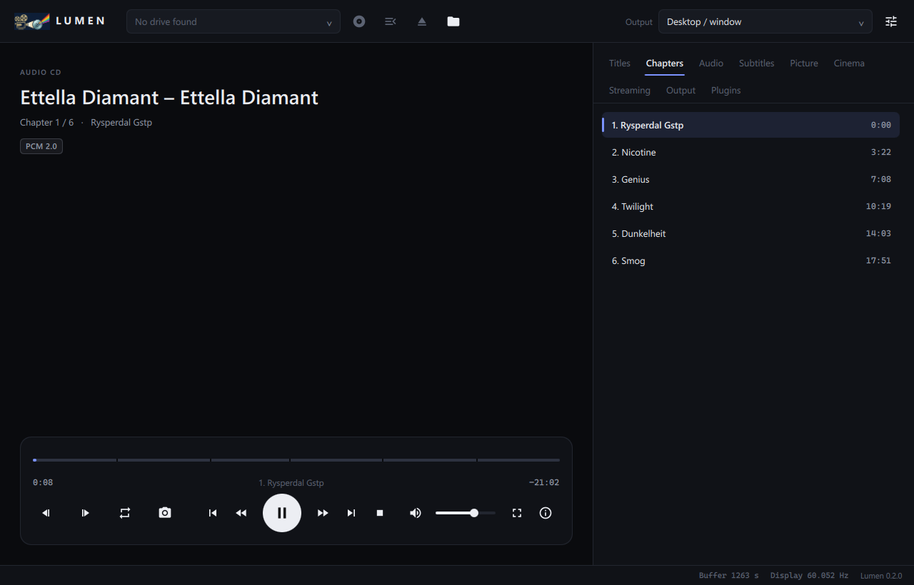

<p align="center"></p>

# Lumen Plugins

The official plugin store of **[Lumen](https://github.com/Karl-Lauterbach24/Lumen)**, the disc and cinema player.
Lumen reads [`index.json`](index.json) from this repository. Find the store under
*Plugins → Plugin store* in Lumen.

| Plugin | Kind | Description |
|--------|------|-------------|
| [My AACS Plugin](plugins/my-aacs-handler) | disc libraries + native + mpv script | Encrypted Blu-rays with your MakeMKV installation or your own libaacs/libbdplus, `KEYDB.cfg` by drag and drop, DCP keys from a key file, a Blu-ray notice on screen |
| [Clock on screen](plugins/osd-clock) | mpv script | Ctrl+T shows the clock, time remaining and when the film ends |
| [Disc identification](plugins/disc-identify) | mpv script | Names the disc you insert: audio CDs with album, artist, year, cover and track names (MusicBrainz), video discs with film title and year (Wikidata). Needs Lumen 0.2.1 |

<p align="center"></p>

> This repository contains **no** copy-protection circumvention (no libaacs, libbdplus or libdvdcss).
> Plugins such as *My AACS Plugin* only use what you provide yourself: your libraries, your MakeMKV installation, your key files.

## Your own store

Any folder with an `index.json` works as a store: a GitHub repository, a web server or a local folder. In Lumen, enter
`owner/repo`, a GitHub URL, or a URL/path under *Plugin store → Your own source*. The format:

```json
{
  "format": 1,
  "name": "My plugins",
  "plugins": [
    {
      "id": "my-plugin", "name": "My plugin", "version": "1.0.0", "description": "…", "author": "…",
      "path": "plugins/my-plugin",
      "files": [
        { "path": "plugin.json", "sha256": "…" },
        { "path": "bin/windows/my_plugin.dll", "platform": "windows", "sha256": "…" }
      ]
    }
  ]
}
```

- `path` is relative to `index.json`, and file paths are relative to the plugin folder.
- Files with `platform` are installed only on that system.
- Lumen checks every SHA-256 sum before it installs anything.
- Newly installed plugins start disabled.

[`tools/build_index.py`](tools/build_index.py) creates `index.json` from the `plugins/` folder.

The plugin format itself (`plugin.json`, the C API, mpv scripts) is documented in Lumen's
[plugins/README.md](https://github.com/Karl-Lauterbach24/Lumen/blob/main/plugins/README.md).

## Building

Native plugins are built with CMake:

```bash
cmake -S . -B build && cmake --build build   # -> plugins/<id>/bin/<platform>/
python tools/build_index.py
```

The GitHub Actions workflow builds Windows, macOS and Linux on every push to `main` and updates `bin/` and `index.json`.

## License

GNU Affero General Public License v3.0 or later, like Lumen ([LICENSE](LICENSE)).
